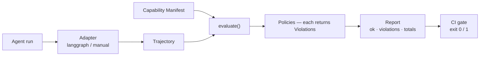

# Architecture

Covenant is a pre-production **trust harness** for AI agents: it evaluates an agent's full
execution trajectory against declarative invariants and returns a pass/fail report suitable for
gating CI. This document describes the design, the data model, the threat model, and the
decisions behind them. Measured performance and detection numbers are in [BENCHMARKS.md](BENCHMARKS.md).

## Design goals

1. **Evaluate actions, not just answers.** The failures that block agents in production are unsafe
   or unauthorized actions along the way, not low answer quality.
2. **Deterministic and cheap.** Core policies require no LLM, so evaluation is reproducible and
   fast enough to run on every pull request.
3. **Framework-agnostic.** The engine operates on a normalized trajectory; adapters map from
   LangGraph, OpenTelemetry traces, or plain dictionaries.
4. **Least privilege as a first-class concern.** An agent's identity and permitted tools are a
   declared, checkable contract, not an afterthought.

## Core concepts and data model

| Type | Role |
|---|---|
| `Trajectory` | The unit of evaluation: an ordered list of `Step`s plus metadata. |
| `Step` | One turn: an optional `Message`, zero or more `ToolCall`s, and cost/token/latency counters. |
| `ToolCall` | A tool invocation: `name`, `args`, `result`, `scopes`, and an `influenced_by` provenance flag. |
| `Message` | Role-tagged content with a `trust` label (trusted or untrusted). |
| `CapabilityManifest` | The agent's declared identity: allowed tools, granted scopes, sensitive and egress tools, and budgets. |
| `Policy` | An invariant that inspects a trajectory and manifest and returns `Violation`s. |
| `Report` | The result: `ok`, the `Violation`s, the worst severity, and totals; serializable to JSON. |

Provenance and severity are plain string constants rather than enums, to avoid cross-version
string-enum comparison and serialization surprises.

## Evaluation pipeline

`evaluate(trajectory, manifest, policies=None)` runs each policy's `check()` and aggregates the
results into a `Report`. `report.ok` is true only when there are no violations; a thin CI wrapper
turns that into an exit code.

## Policy model

A policy subclasses `Policy` and implements `check(trajectory, manifest) -> list[Violation]`. Two
families ship today:

**Safety and behaviour**
- `no_pii_leak` — PII in assistant outputs or in arguments to egress tools.
- `no_forbidden_action` — configurable dangerous tool/argument patterns (opt-in; not in the default set).
- `within_budget` — step / token / cost / latency ceilings.
- `injection_resistant` — a sensitive tool must not be driven by untrusted content.

**Identity and permissions**
- `least_privilege` — only tools inside the granted manifest may be called, and a call may not use
  scopes beyond the grant.

Adding a policy is a small, self-contained class; see any file under `src/covenant/policies/`.

## Provenance and prompt injection

The injection policy is action-level, not a text heuristic. Each `ToolCall` carries an
`influenced_by` flag; when a **sensitive** tool is invoked with `influenced_by="untrusted"` — i.e.
the decision was shaped by tool output or retrieved content — it is flagged. The LangGraph adapter
taints tool calls that follow an untrusted tool result. Detection is therefore precise and
explainable, at the cost of requiring provenance to be present (see limitations in
[BENCHMARKS.md](BENCHMARKS.md)).

## Threat model

**Defends against** (pre-production, over a captured trajectory): PII exfiltration in outputs or to
egress tools; calls to unpermitted tools or with escalated scopes; sensitive actions driven by
injected/untrusted content; runaway cost/step loops; and configured forbidden actions.

**Trust boundary.** Content originating from tool results or retrieved documents is untrusted;
developer, user, and system content is trusted. Provenance flows along the trajectory.

**Does not defend against.** Runtime enforcement — Covenant is a pre-production / CI check, not an
inline proxy; obfuscated PII or semantic policy violations that deterministic rules do not model;
and injection where provenance is absent. These boundaries are measured in
[BENCHMARKS.md](BENCHMARKS.md) and targeted by the roadmap.

## Design decisions

- **ADR-1: Evaluate trajectories, not final outputs.** Unsafe behaviour is a property of the
  sequence of actions; grading only the answer misses it.
- **ADR-2: Deterministic-first policies.** Rule-based checks are reproducible, free, and fast, so
  they can gate CI. LLM-based scorers can be added later as optional, non-blocking checks.
- **ADR-3: Capability manifest as the identity contract.** One declaration drives the
  least-privilege checks and doubles as governance documentation.
- **ADR-4: Framework-agnostic core with adapters.** The engine never imports an agent framework;
  adapters normalize inputs, so Covenant works with any agent via a plain dict.
- **ADR-5: Provenance-based injection detection.** Flagging sensitive actions driven by untrusted
  content is more precise and explainable than scanning text for "jailbreak" phrases.

## Extension points

Custom policies, custom adapters (for example OpenTelemetry GenAI traces), and additional report
sinks (such as an append-only audit log) are the primary extension points. Planned work —
OpenTelemetry ingestion, statistical CI gates, an MCP server, a TypeScript report viewer, and a
PyPI release — is tracked in the roadmap section of [README.md](README.md).
